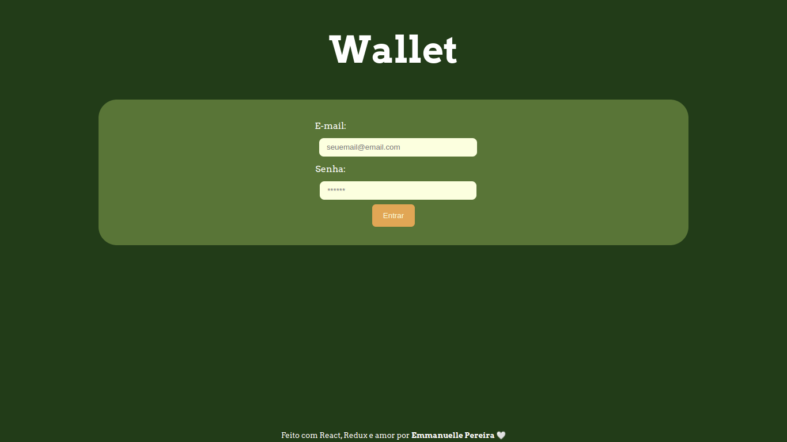
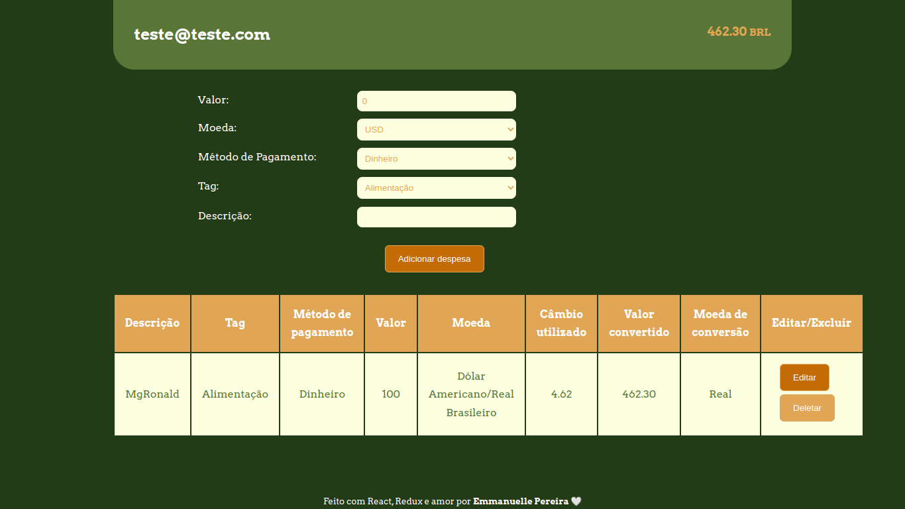

# TrybeWallet


# Contexto
Este projeto desenvolvido enquanto aluna na [Trybe](https://www.betrybe.com/), tinha o objetivo de criar uma aplicação que computa gastos em diferentes moedas e converte tudo para uma única moeda escolhida pelo usuário.


### Objetivos
Desenvolver uma carteira de controle de gastos com conversor de moedas usando um endpoint da API [Cotação de Moeda](https://docs.awesomeapi.com.br/api-de-moedas) para obter as informações sobre os nomes, cotações e outros dados sobre as moedas.
Ao utilizar essa aplicação um usuário deverá ser capaz de:

- Adicionar, remover e editar um gasto;
- Visualizar uma tabelas com seus gastos;
- Visualizar o total de gastos convertidos para uma moeda de escolha;

As habilidades exercitadas neste projeto foram:

- Criar um store Redux em aplicações React.
- Criar reducers no Redux em aplicações React.
- Criar actions no Redux em aplicações React.
- Criar dispatchers no Redux em aplicações React.
- Conectar Redux aos componentes React.
- Criar actions assíncronas na sua aplicação React que faz uso de Redux.


## Tecnologias usadas

Front-end:
* React
* Redux
* HTML/CSS
* Pacotes NPM


## Capturas de telas


---

---


## Instalando dependências

* No diretório raiz do projeto:
```
npm install
```

## Iniciando aplicação

* Rodando localmente:
```
npm start
```

## Executando testes

* Para rodar todos os testes:
```
npm test
```

Obs.: os testes já vieram implementados pela equipe da Trybe.
